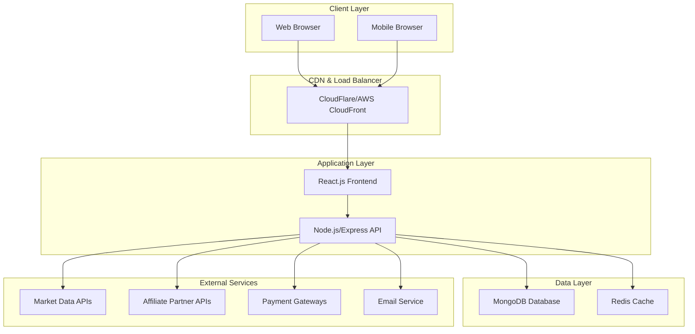

# Design Document

## Overview

The Indian Investment Platform is a comprehensive web application that provides financial education, tools, and affiliate services tailored for the Indian market. The platform follows a modern, scalable architecture using React.js for the frontend, Node.js/Express for the backend, and MongoDB for data storage. The system integrates with multiple affiliate partners and provides real-time market data through APIs.

## Architecture

### High-Level Architecture



### Technology Stack

**Frontend:**
- React.js 18+ with TypeScript
- Next.js for SSR and SEO optimization
- Tailwind CSS for responsive design
- Chart.js for financial charts and graphs
- React Query for API state management

**Backend:**
- Node.js with Express.js
- TypeScript for type safety
- JWT for authentication
- Mongoose for MongoDB ODM
- Redis for caching and session management

**Database:**
- MongoDB for primary data storage
- Redis for caching and real-time data

**Infrastructure:**
- Docker for containerization
- AWS/Azure for cloud hosting
- CloudFlare for CDN and security
- GitHub Actions for CI/CD

## Components and Interfaces

### Frontend Components

#### 1. Content Management System
- **ArticleViewer**: Displays financial articles with rich formatting
- **CategoryBrowser**: Hierarchical navigation for content categories
- **SearchInterface**: Advanced search with filters and suggestions
- **RelatedContent**: Recommends related articles and tools

#### 2. Affiliate Integration Components
- **LoanComparison**: Side-by-side loan comparison with filtering
- **CreditCardGrid**: Card-based display of credit card offers
- **BrokerDirectory**: Detailed broker profiles with feature comparison
- **AffiliateTracker**: Handles click tracking and attribution

#### 3. Financial Tools
- **CalculatorSuite**: Collection of financial calculators
- **SIPCalculator**: Systematic Investment Plan calculator
- **EMICalculator**: Equated Monthly Installment calculator
- **TaxPlanner**: Indian tax calculation and planning tool
- **GoalPlanner**: Investment goal planning interface

#### 4. Market Data Components
- **LiveMarketTicker**: Real-time market indices display
- **NewsAggregator**: Financial news with categorization
- **MarketAnalysis**: Expert analysis and commentary
- **CompanyProfiler**: Indian company information and financials

### Backend Services

#### 1. Content Service
```typescript
interface ContentService {
  getArticles(category?: string, limit?: number): Promise<Article[]>
  searchContent(query: string, filters: SearchFilters): Promise<SearchResult[]>
  getRelatedContent(articleId: string): Promise<Article[]>
  incrementViewCount(articleId: string): Promise<void>
}
```

#### 2. Affiliate Service
```typescript
interface AffiliateService {
  trackClick(partnerId: string, userId: string, productType: string): Promise<string>
  getPartnerProducts(partnerId: string, productType: string): Promise<Product[]>
  recordConversion(trackingId: string, conversionData: ConversionData): Promise<void>
  generateAffiliateReport(partnerId: string, dateRange: DateRange): Promise<Report>
}
```

#### 3. Market Data Service
```typescript
interface MarketDataService {
  getLiveIndices(): Promise<MarketIndex[]>
  getStockPrice(symbol: string): Promise<StockData>
  getMarketNews(category?: string): Promise<NewsItem[]>
  getCompanyProfile(symbol: string): Promise<CompanyProfile>
}
```

#### 4. User Service
```typescript
interface UserService {
  registerUser(userData: UserRegistration): Promise<User>
  authenticateUser(credentials: LoginCredentials): Promise<AuthResult>
  updateProfile(userId: string, profileData: ProfileUpdate): Promise<User>
  trackUserActivity(userId: string, activity: UserActivity): Promise<void>
}
```

## Data Models

### Core Entities

#### Article
```typescript
interface Article {
  _id: ObjectId
  title: string
  slug: string
  content: string
  excerpt: string
  category: string
  subcategory: string
  tags: string[]
  author: Author
  publishedAt: Date
  updatedAt: Date
  viewCount: number
  seoMetadata: SEOMetadata
  relatedArticles: ObjectId[]
}
```

#### AffiliatePartner
```typescript
interface AffiliatePartner {
  _id: ObjectId
  name: string
  type: 'loan' | 'credit_card' | 'broker'
  apiEndpoint?: string
  commissionStructure: CommissionStructure
  isActive: boolean
  logoUrl: string
  description: string
  products: Product[]
  trackingConfig: TrackingConfig
}
```

#### Product
```typescript
interface Product {
  _id: ObjectId
  partnerId: ObjectId
  name: string
  type: string
  features: ProductFeature[]
  eligibility: EligibilityRequirement[]
  interestRate?: number
  fees: Fee[]
  applicationUrl: string
  isActive: boolean
  priority: number
}
```

#### User
```typescript
interface User {
  _id: ObjectId
  email: string
  hashedPassword: string
  profile: UserProfile
  preferences: UserPreferences
  activityLog: UserActivity[]
  createdAt: Date
  lastLoginAt: Date
  isVerified: boolean
}
```

#### AffiliateClick
```typescript
interface AffiliateClick {
  _id: ObjectId
  trackingId: string
  userId?: ObjectId
  partnerId: ObjectId
  productId: ObjectId
  clickedAt: Date
  ipAddress: string
  userAgent: string
  referrer: string
  converted: boolean
  conversionDate?: Date
  commissionAmount?: number
}
```

## Error Handling

### Error Categories

1. **Client Errors (4xx)**
   - 400: Bad Request - Invalid input data
   - 401: Unauthorized - Authentication required
   - 403: Forbidden - Insufficient permissions
   - 404: Not Found - Resource doesn't exist
   - 429: Too Many Requests - Rate limiting

2. **Server Errors (5xx)**
   - 500: Internal Server Error - Unexpected server error
   - 502: Bad Gateway - External service unavailable
   - 503: Service Unavailable - Temporary service disruption

### Error Response Format
```typescript
interface ErrorResponse {
  error: {
    code: string
    message: string
    details?: any
    timestamp: string
    requestId: string
  }
}
```

### Error Handling Strategy

1. **Frontend Error Boundaries**: React error boundaries to catch and display user-friendly error messages
2. **API Error Interceptors**: Axios interceptors to handle common error scenarios
3. **Retry Logic**: Automatic retry for transient failures with exponential backoff
4. **Fallback Content**: Display cached or default content when external services fail
5. **Error Logging**: Comprehensive error logging with correlation IDs for debugging

## Testing Strategy

### Unit Testing
- **Frontend**: Jest + React Testing Library for component testing
- **Backend**: Jest + Supertest for API endpoint testing
- **Coverage Target**: Minimum 80% code coverage
- **Test Categories**: Component rendering, user interactions, API responses, business logic

### Integration Testing
- **API Integration**: Test complete request/response cycles
- **Database Integration**: Test data persistence and retrieval
- **External Service Integration**: Mock external APIs for consistent testing
- **Affiliate Tracking**: End-to-end testing of click tracking and conversion flow

### End-to-End Testing
- **User Journeys**: Cypress tests for critical user paths
- **Cross-Browser Testing**: Automated testing across Chrome, Firefox, Safari, Edge
- **Mobile Testing**: Responsive design testing on various device sizes
- **Performance Testing**: Load testing for high-traffic scenarios

### Security Testing
- **Authentication Testing**: Verify JWT token handling and session management
- **Input Validation**: Test for SQL injection, XSS, and other security vulnerabilities
- **Rate Limiting**: Verify API rate limiting and abuse prevention
- **Data Privacy**: Ensure compliance with data protection requirements

### Performance Testing
- **Load Testing**: Simulate concurrent users and measure response times
- **Stress Testing**: Determine system breaking points and recovery behavior
- **Database Performance**: Query optimization and indexing validation
- **CDN Performance**: Verify content delivery and caching effectiveness

### Monitoring and Analytics
- **Application Monitoring**: Real-time performance and error tracking
- **User Analytics**: Track user behavior and engagement metrics
- **Affiliate Performance**: Monitor click-through rates and conversion metrics
- **Business Intelligence**: Revenue tracking and partner performance analysis